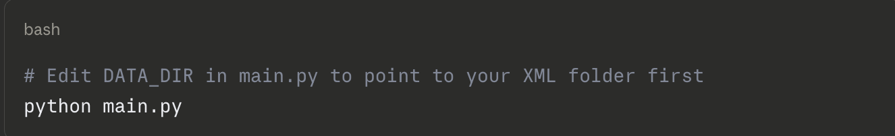
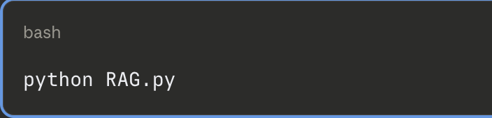
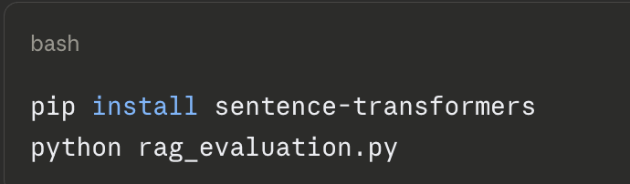
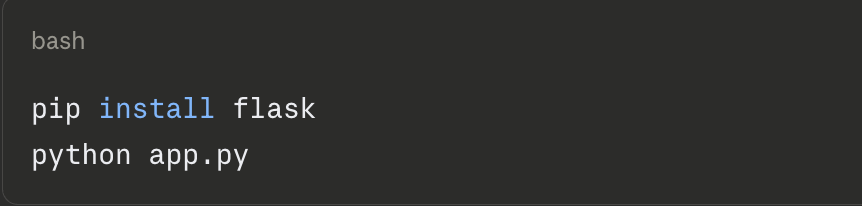

# MedSearch AI — FDA Drug Label Retrieval & RAG System
## CSC 575 – Intelligent Information Retrieval | Spring 2025-26
Team members: Kritika Bhat, Gracy Patel, Teresa Chirayil

# Project overview
MedSearch AI is an end-to-end information retrieval and retrieval-augmented generation (RAG) system for FDA drug label search. Users can ask plain-language questions about drug side effects, interactions, and dosage, and get answers grounded in verified FDA label text.

ProjectMed/

├── main.py                  # Step 1: Parse FDA SPL XMLs → build corpus

├── drug_corpus_json         # Processed corpus (1,468 drug documents)

├── retrieval_system.py      # Step 2: TF-IDF, BM25, Dense, Hybrid retrievers + evaluation

├── query_set.py             # Query generation and sampling

├── evaluation.py            # Retrieval metrics (Top-K, Precision, Recall, nDCG)

├── RAG.py                   # Step 3: RAG pipeline (BM25 + Llama 3.2 via Ollama)

├── rag_evaluation.py        # Step 4: SBERT faithfulness + manual relevance scoring

├── README.md

└── self_evaluation.pdf

# Dataset

source: FDA Structured Product Labeling (SPL) — February 2026 monthly update prescription drug XML files only.

## How to get the Dataset?

Option 1 — Download from FDA directly:

https://www.fda.gov/industry/fda-data-standards-advisory-board/structured-product-labeling-resources 

Download the February 2026 monthly update for prescription drugs.

Option 2 - Use the pre-built corpus
The processed corpus drug_corpus_json is already included in this submission.
It contains 1,468 unique drug documents extracted from the raw XMLs.
You can skip main.py entirely and start from retrieval_system.py

Google Drive link to raw XMLs:

Dataset Link:https://drive.google.com/file/d/1tnULigqpKgIf2iW3QZTCC73hVJBv5uX7/view?usp=drive_link

# Setup & Installation

# Requirements
-> Python 3.10+

-> Ollama (for RAG and evaluation)

## Install python dependencies

pip install pandas scikit-learn rank-bm25 sentence-transformers ollama flask

## Install Ollama + pull Llama 3.2

Download Ollama from https://ollama.com and install it
ollama pull llama3.2

# How to Run?

Step 1 — (Optional) Rebuild the corpus from raw XMLs
Only needed if you downloaded the raw FDA XML files.

Output: drug_corpus_json

Step 2 — Run retrieval system + evaluation
Builds all four retrievers (TF-IDF, BM25, Dense, Hybrid) and evaluates them.

python retrieval_system.py

Output: Prints Top-K Accuracy, Precision@K, Recall@K, nDCG@K for all four retrievers.

step 3 - Run the RAG pipeline
Runs BM25 retrieval + Llama 3.2 generation on 20 evaluation queries.
Make sure Ollama is running before this step.

output: rag_results.txt

Step 4 — Evaluate RAG answers
Computes SBERT faithfulness scores automatically, then prompts you to manually score relevance (1–3) for each of the 20 queries.

Output: rag_scores.txt

Step 6 — (Optional) Launch the web interface

Open browser at http://localhost:5000

# Evaluation Metrics

-> Retrieval: Top-K Accuracy, Precision@K, Recall@K, nDCG@K at k = 1, 3, 5, 10

-> RAG Faithfulness: SBERT cosine similarity (answer vs retrieved context), mapped 1–3

-> RAG Relevance: Manual scoring on 3-point scale

-> Drug Mention Rate: Whether correct drug name appears in generated answer

# Notes

-> The corpus drug_corpus_json must be in the same directory as all Python files

-> All scripts use relative paths — run from inside the ProjectMed/ folder

-> Ollama must be installed and running for RAG.py, rag_evaluation.py, baseline.py, and compare_evaluation.py

-> First Ollama call per session is slower (model loading); subsequent calls are faster